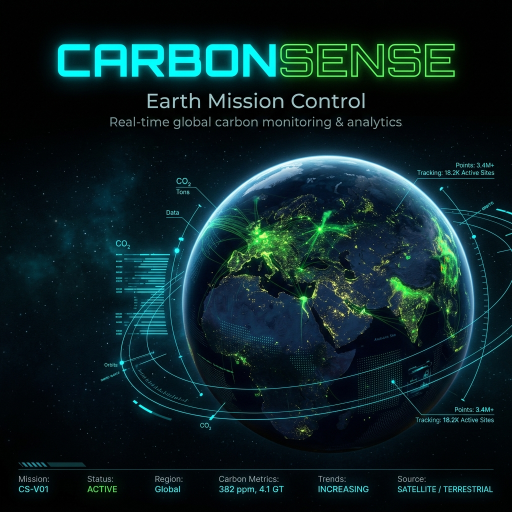
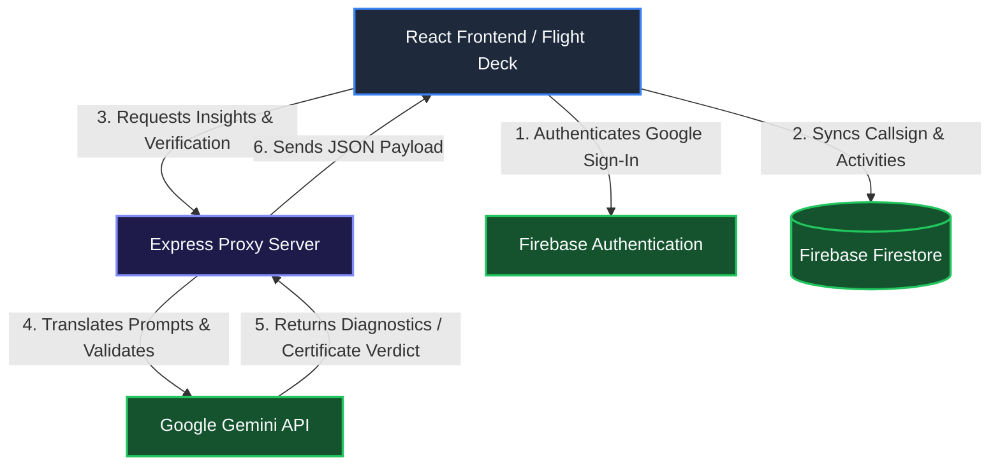

<div align="center">

# 🌍 CarbonSense

### *Track emissions. Tune your lifestyle. Heal the planet.*

[](https://carbonsense-xi.vercel.app)
[](https://react.dev/)
[](https://tailwindcss.com/)
[](https://firebase.google.com/)
[](https://ai.google.dev/)

<br />



<p align="center" style="font-size: 1.1rem; max-width: 700px; margin: 1.5rem auto; color: #a0aec0;">
  CarbonSense is a highly immersive, cosmic/cyberpunk carbon footprint tracking dashboard. Gamified as a pilot cockpit, it empowers you to calculate your emissions, log activities, receive real-time AI advice from Google Gemini, compete on a global leaderboard, and earn certificates.
</p>

[**Launch Flight Deck 🚀**](https://carbonsense-xi.vercel.app)

---

</div>

## 🪐 Key Features

*   🌍 **Dynamic Earth Biome**: Watch the planet transform in real-time. As your carbon emissions rise, the Earth shifts from a vibrant, healthy green biome into a smog-choked, dark industrial wasteland.
*   ⚡ **AI Carbon Diagnostics (Gemini 1.5 Flash)**: Connects with the **Google Gemini API** to analyze your emission metrics and output tailored action plans, complete with step-by-step reduction directives.
*   📊 **Fleet Telemetry (Activity Logger)**: Add daily commutes, flight duration, diet types (vegan, carnivore, etc.), and appliance usage. Check your historical charts and delete activities to log new values.
*   🏆 **Global Fleet Leaderboard**: Authenticate via Google Sign-In to sync your data. Compete against other carbon pilots worldwide in real-time.
*   🚀 **Pilot Callsign Onboarding**: Personalized onboarding popup prompts new pilots on their first login to establish their callsign (skippable).
*   💬 **HUD Invites**: Non-obtrusive floating sign-in prompt dynamically invites guest pilots to sync their telemetry to Firebase.
*   📜 **Verification Engine & Certificates**: Get your carbon reduction verified by the **CarbonSense Verification Engine**. Earn a downloadable high-resolution digital certificate once you reach your target limits.

---

## 🛠 Tech Stack

| Layer | Technologies Used | Description |
| :--- | :--- | :--- |
| **Frontend** | React 19, Vite, TypeScript | Modern UI scaffold with hot module reloading. |
| **Styling** | Tailwind CSS v4, Motion (Framer Motion v12) | Cyberpunk dark-themed UI with glassmorphism overlays and GPU-accelerated micro-animations. |
| **Database & Auth** | Firebase Firestore, Firebase Authentication | Secure Google OAuth credentials and real-time database synchronization for user profiles, activities, and leaderboards. |
| **Backend** | Node.js, Express, Helmet, Rate-Limit | Secure server proxy that routes AI requests to Google Gemini, protecting API credentials and preventing scraping/abuse. |
| **Testing** | Vitest, JSDOM | Comprehensive unit and integration test suite checking state management, calculators, and API routers. |

---

## 🛰 Architecture & Data Flow



---

## 🚀 Getting Started

Follow these steps to spin up your own CarbonSense Flight Deck locally.

### Prerequisites
- [Node.js](https://nodejs.org/) (v18+)
- A Google Gemini API Key (get one from [Google AI Studio](https://aistudio.google.com/))
- A Firebase Project (with Firestore and Google Auth enabled)

### 1. Clone & Install
```bash
git clone https://github.com/ogMaverick12/carbonsense.git
cd carbonsense
npm install
```

### 2. Configure Environment Variables
Create a `.env` file at the root of the project (or copy `.env.example` to `.env`):

```env
# Server Configuration
PORT=3000
GEMINI_API_KEY=your_gemini_api_key_here

# Firebase Web App Config (Found in Firebase Console settings)
VITE_FIREBASE_API_KEY=your_firebase_api_key
VITE_FIREBASE_AUTH_DOMAIN=your_firebase_auth_domain
VITE_FIREBASE_PROJECT_ID=your_firebase_project_id
VITE_FIREBASE_STORAGE_BUCKET=your_firebase_storage_bucket
VITE_FIREBASE_MESSAGING_SENDER_ID=your_firebase_sender_id
VITE_FIREBASE_APP_ID=your_firebase_app_id
```

### 3. Run Locally
Start both the Express backend proxy and Vite dev server simultaneously:
```bash
npm run dev
```
Open your browser to `http://localhost:3000` (or the port specified in console output).

---

## 🧪 Testing

Run unit and integration tests using Vitest:

```bash
# Run tests once
npm run test

# Run tests in watch mode
npm run test:watch

# Generate code coverage reports
npm run test:coverage
```

---

## 🛡 Security & Best Practices

- **API Protection**: The frontend never communicates directly with the Gemini API. All prompts are proxied through the Express server, ensuring your `GEMINI_API_KEY` is never exposed in the browser network tab.
- **CORS & CORP**: Configured using Helmet to enforce secure header layouts and prevent cross-origin resource extraction.
- **Rate Limiting**: Integrated `express-rate-limit` on backend endpoints to mitigate denial-of-service attempts.

---

## 📜 License

Distributed under the MIT License. See [LICENSE](LICENSE) for details.

*Fly clean, Pilots. 🛰*
